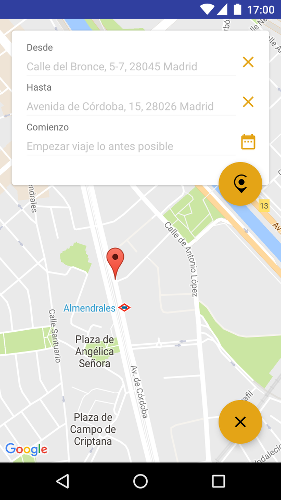
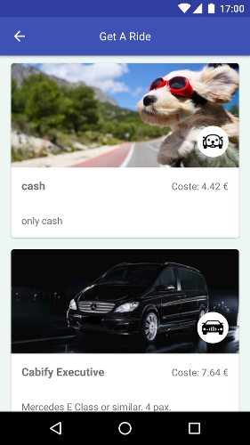

Introduction
------------

This is the solution to the Cabify Mobile Challenge here:

* https://gist.github.com/pedroduran/a96a932b316612e0e0f1058a5a8ef830
 

To resolve this challenge I decided to use as the base of my architecture the [Clean Architecture][clean], splitting the project into 3 different layers:

* **Presentation**: That constains all the presentation logic. Following the [MVP][mvp] pattern, I use **views** to control all actions related to the UI/UX while the **presenters** will manage all the logic based on the user's actions.
* **Domain**: It manages all the business logic of the app. In the middle between the UI/UX and the backend.
* **Data**: This layer is in charge of the external communications. In this case it is needed to connect with the Cabify API, so I used a **net** layer for that. Using [Retrofit 2][retrofit2] as library to make the necessary RESTFull calls.

UX
--
In order to get a list of estimated costs the user can ping two places directly from the map.

It is also possible to set the date of the trip using the calendar icon that appears in the from/to pannel on the main screen.

Finally the app will make a request to the Cabiy API in order to get the list of estimations. I list all items for the user to choose the more proper one base on the cost of the trip.

Testing
-------
I also provide a sample battery of JUnit test. This architecture is in deep used to facilitate unit testing and CI. [JUnit][junit] and [Mockito][mockito] are the libraries used to accomplish this task.

Libraries used in this project
------------------------------
* [Retrofit 2] [retrofit2]
* [Dagger] [dagger]
* [JUnit] [junit]
* [Mockito] [mockito]
* [Picasso] [picasso]
* [Butterknife] [butterknife]

License
-------

    Copyright 2015 Karumi

    Licensed under the Apache License, Version 2.0 (the "License");
    you may not use this file except in compliance with the License.
    You may obtain a copy of the License at

       http://www.apache.org/licenses/LICENSE-2.0

    Unless required by applicable law or agreed to in writing, software
    distributed under the License is distributed on an "AS IS" BASIS,
    WITHOUT WARRANTIES OR CONDITIONS OF ANY KIND, either express or implied.
    See the License for the specific language governing permissions and
    limitations under the License.

[clean]: https://blog.8thlight.com/uncle-bob/2012/08/13/the-clean-architecture.html
[mvp]: http://martinfowler.com/eaaDev/uiArchs.html#Model-view-presentermvp
[retrofit2]: http://square.github.io/retrofit/
[dagger]: https://github.com/square/dagger
[junit]: https://github.com/junit-team/junit
[mockito]: http://mockito.org/
[picasso]: http://square.github.io/picasso/
[butterknife]: http://jakewharton.github.io/butterknife/